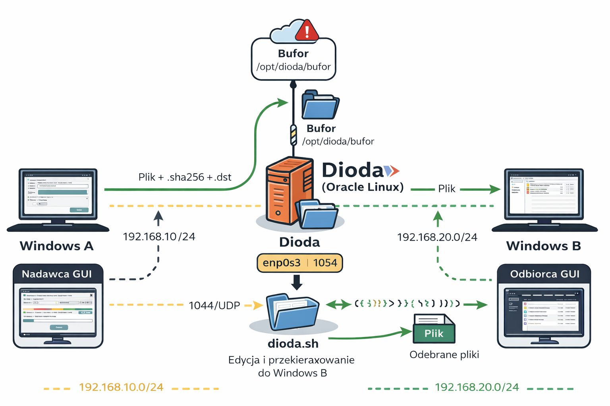
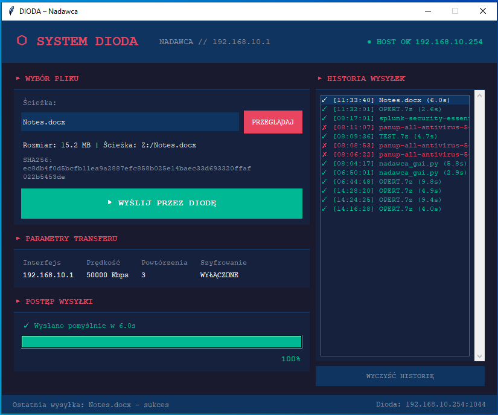
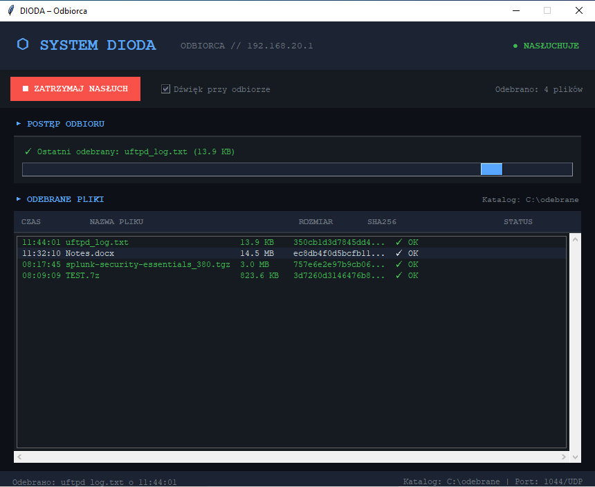

**SYSTEM DIODA**

Wirtualna Dioda Danych

*Dokumentacja techniczna systemu jednostronnego transferu danych*

|                      |                                   |
|----------------------|-----------------------------------|
| **Wersja dokumentu** | **1.0**                           |
| Klasyfikacja         | Wewnętrzna                        |
| Platforma            | VirtualBox / Oracle Linux 8       |
| Protokół transferu   | UFTP (UDP File Transfer Protocol) |
| Data opracowania     | 2026                              |


#  1. Opis rozwiązania

## 1.1 Czym jest dioda danych?

Dioda danych to urządzenie lub rozwiązanie sieciowe zapewniające
jednostronny przepływ informacji pomiędzy dwoma sieciami lub systemami.
Fizyczna zasada działania uniemożliwia jakikolwiek przepływ danych w
kierunku odwrotnym — od odbiorcy do nadawcy.

Komercyjne diody danych, takie jak polska ZNO-50, są certyfikowanymi
urządzeniami sprzętowymi stosowanymi w systemach ochrony informacji
niejawnych, infrastrukturze krytycznej oraz sieciach wojskowych i
rządowych. Gwarantują fizyczną jednostronność przepływu danych na
poziomie warstwy sprzętowej.

## 1.2 Cel i zakres projektu

Niniejszy projekt stanowi środowisko testowe i laboratoryjne imitujące
zachowanie fizycznej diody danych przy użyciu ogólnodostępnych narzędzi
open source. System nie jest certyfikowanym urządzeniem bezpieczeństwa i
nie jest przeznaczony do ochrony informacji niejawnych — służy do celów
edukacyjnych, testowych i demonstracyjnych.

|  |
|----|
| **UWAGA: System stanowi środowisko laboratoryjne. Do ochrony informacji niejawnych należy stosować certyfikowane urządzenia sprzętowe.** |

Główne założenia projektu:

- Symulacja jednostronnego przepływu danych na poziomie oprogramowania.

- Weryfikacja integralności przesyłanych plików za pomocą sum
  kontrolnych SHA-256.

- Szyfrowanie transmisji algorytmem AES-256-CBC.

- Skanowanie antywirusowe plików przed ich przekazaniem do odbiorcy.

- Kolejkowanie transferu przy dużej liczbie jednoczesnych nadawców.

- Graficzne interfejsy użytkownika dla stacji nadawczej i odbiorczej.

## 1.3 Porównanie z fizyczną diodą ZNO-50

|                |                       |                              |
|----------------|-----------------------|------------------------------|
| **Cecha**      | **ZNO-50 (fizyczna)** | **System Dioda (wirtualna)** |
| Jednostronność | Sprzętowa (hardware)  | Programowa (iptables)        |
| Certyfikacja   | ABW / SKW             | Brak                         |
| Szyfrowanie    | Sprzętowe             | AES-256-CBC (UFTP)           |
| Weryfikacja    | Wbudowana             | SHA-256 (skrypt)             |
| Antywirus      | Brak / opcjonalny     | ClamAV                       |
| Przeznaczenie  | Produkcja / niejawne  | Testy / laboratorium         |

#  2. Architektura systemu

## 2.1 Topologia sieci

System składa się z trzech maszyn wirtualnych uruchomionych w środowisku
VirtualBox. Maszyny komunikują się wyłącznie przez izolowane sieci
wewnętrzne VirtualBox (Internal Network), bez dostępu do sieci
zewnętrznej.

> \[Windows A\] \[Oracle Linux 8\] \[Windows B\]
>
> NADAWCA DIODA ODBIORCA
>
> 192.168.10.1 eth0: 192.168.10.254 192.168.20.1
>
> GW: .10.254 eth1: 192.168.20.254 GW: .20.254
>
> \| \| \| \|
>
> +----siec-nadawcy----+ +--siec-odbiorcy+
>
> 192.168.10.0/24 192.168.20.0/24
>
> ==========\> TYLKO W TE STRONE ==========\>
>
> \<========= BLOKADA IPTABLES \<=========



*Rysunek 1. Schemat architektury systemu*

## 2.2 Adresy IP i konfiguracja sieci

|  |  |  |  |  |
|----|----|----|----|----|
| **Maszyna** | **Adres IP** | **Maska** | **Brama domyślna** | **Rola** |
| Windows A | 192.168.10.1 | 255.255.255.0 | 192.168.10.254 | Nadawca plików |
| Oracle Linux 8 (eth0) | 192.168.10.254 | 255.255.255.0 | brak | Dioda — odbiór |
| Oracle Linux 8 (eth1) | 192.168.20.254 | 255.255.255.0 | brak | Dioda — wysyłka |
| Windows B | 192.168.20.1 | 255.255.255.0 | 192.168.20.254 | Odbiorca plików |

|  |
|----|
| Dioda (Oracle Linux 8) nie posiada bramy domyślnej. Posiada dwie karty sieciowe w dwóch różnych podsieciach i pełni funkcję jedynego węzła pośredniczącego. |

## 2.3 Komponenty systemu

|                 |                            |                                 |
|-----------------|----------------------------|---------------------------------|
| **Komponent**   | **Wersja / źródło**        | **Przeznaczenie**               |
| VirtualBox      | 7.x                        | środowisko wirtualizacji        |
| Oracle Linux 8  | 8.x                        | System operacyjny diody         |
| UFTP            | 5.x (kompilacja ze źródeł) | Protokół UDP Multicast transfer |
| iptables        | Wbudowany OL8              | Wymuszenie jednostronności      |
| ClamAV          | Repozytorium EPEL          | Skanowanie antywirusowe         |
| inotify-tools   | Repozytorium EPEL          | Monitorowanie katalogu bufora   |
| Python 3.10+    | python.org                 | GUI nadawcy i odbiorcy          |
| nadawca_gui.py  | Własny                     | Interfejs graficzny nadawcy     |
| odbiorca_gui.py | Własny                     | Interfejs graficzny odbiorcy    |

#  3. Zasada działania

## 3.1 Przepływ danych

Proces transferu pliku od nadawcy do odbiorcy składa się z siedmiu
kolejnych etapów realizowanych automatycznie przez system:

|  |  |  |
|----|----|----|
| **Etap** | **Działanie** | **Odpowiedzialny** |
| 1 | Użytkownik wybiera plik w GUI i uruchamia wysyłkę | Windows A — nadawca_gui.py |
| 2 | uftp.exe wysyła plik przez UDP Multicast z szyfrowaniem AES-256-CBC i sumą SHA-256 | Windows A — uftp.exe |
| 3 | uftpd na diodzie odbiera plik i zapisuje do katalogu bufora /opt/dioda/bufor/ | Oracle Linux 8 — uftpd |
| 4 | Skrypt dioda.sh wykrywa nowy plik (inotifywait), weryfikuje rozmiar i sumę SHA-256 | Oracle Linux 8 — dioda.sh |
| 5 | ClamAV skanuje plik pod kątem zagrożeń złośliwym oprogramowaniem | Oracle Linux 8 — clamscan |
| 6 | uftp przesyła zweryfikowany plik przez eth1 do sieci odbiorcy | Oracle Linux 8 — uftp |
| 7 | uftpd na Windows B odbiera plik i zapisuje do C:\odebrane\\ GUI pokazuje powiadomienie. | Windows B — uftpd + GUI |

## 3.2 Wymuszenie jednostronności — iptables

Jednostronność przepływu danych jest wymuszana przez reguły iptables na
maszynie diody. Reguły są aplikowane automatycznie podczas startu usługi
dioda.service:
```bash
> # Reguły zezwalające (przepływ do przodu):
>
> INPUT -i eth0 -s 192.168.10.0/24 --\> ACCEPT (odbiór od nadawcy)
>
> OUTPUT -o eth1 -d 192.168.20.0/24 --\> ACCEPT (wysyłka do odbiorcy)
>
> # Reguły blokujące (blokada kierunku odwrotnego):
>
> INPUT -i eth1 --\> DROP (blokada od strony odbiorcy)
>
> OUTPUT -o eth0 --\> DROP (blokada do strony nadawcy)
>
> FORWARD eth1 -\> eth0 --\> DROP (blokada przekierowania)
```
## 3.3 Kolejkowanie

System obsługuje wielu jednoczesnych nadawców dzięki mechanizmowi
kolejkowania wbudowanemu w skrypt dioda.sh. Zabezpiecza to diodę przed
przeciążeniem przy dużej liczbie jednoczesnych transferów:

|  |  |  |
|----|----|----|
| **Parametr** | **Wartość** | **Opis** |
| Max jednoczesnych | 5 | Maksymalna liczba plików przetwarzanych równocześnie |
| Limit dysku bufora | 80% | Przy przekroczeniu dioda wstrzymuje odbiór do czasu zwolnienia miejsca |
| Maksymalny rozmiar pliku | 1024 MB | Pliki większe są automatycznie odrzucane z wpisem do logu |
| Mechanizm wykrywania | inotifywait | Zdarzenie close_write wykrywa nowo odebrane pliki |

## 3.4 Bezpieczeństwo transferu

Każdy plik przechodzi przez trzy niezależne mechanizmy weryfikacji przed
przekazaniem do odbiorcy:

- **Szyfrowanie AES-256-CBC —** treść pliku jest szyfrowana podczas
  transmisji UDP. Przechwycenie pakietów w sieci nie ujawnia zawartości.

- **Suma kontrolna SHA-256 —** nadawca oblicza i dołącza sumę kontrolną.
  Dioda weryfikuje integralność przed przekazaniem dalej.

- **Skanowanie ClamAV —** każdy odebrany plik jest skanowany przez
  silnik antywirusowy. Pliki zawierające złośliwy kod są odrzucane i
  logowane.

#  4. Interfejsy użytkownika

## 4.1 GUI Nadawcy — Windows A

Aplikacja nadawcy (nadawca_gui.py) uruchamiana na Windows A zapewnia
graficzny interfejs do wysyłania plików przez diodę. Została napisana w
języku Python z użyciem biblioteki tkinter i nie wymaga instalacji
dodatkowych pakietów.

|                     |                                                       |
|---------------------|-------------------------------------------------------|
| **Funkcja**         | **Opis**                                              |
| Wybór pliku         | Okienko systemowe do wyboru pliku z dysku             |
| Obliczanie SHA-256  | Automatyczne w tle przed wysyłką                      |
| Wskaźnik połączenia | Sprawdza dostępność diody co 5 sekund                 |
| Pasek postępu       | Wizualizacja procentowego postępu wysyłki             |
| Historia transferów | Lista wysłanych plików z kolorowym statusem           |
| Parametry UFTP      | AES-256-CBC, SHA-256, prędkość 50 Mbps, 3 powtórzenia |



*Rysunek 2. Interfejs graficzny nadawcy (nadawca_gui.py)*

## 4.2 GUI Odbiorcy — Windows B

Aplikacja odbiorcy (odbiorca_gui.py) uruchamiana na Windows B wyświetla
listę odebranych plików i zarządza procesem nasłuchiwania. Aplikacja
uruchamia się automatycznie przy logowaniu do systemu Windows.

|  |  |
|----|----|
| **Funkcja** | **Opis** |
| Autostart nasłuchu | Nasłuch startuje automatycznie 1 sekundę po uruchomieniu |
| Auto-restart uftpd | Watchdog wznawia proces uftpd.exe po awarii |
| Lista odebranych | Czas, nazwa, rozmiar, SHA-256, status (OK/BŁĄD) |
| Powiadomienia | Okienko popup z działkiem — zamyka się po 5 sekundach |
| Dźwięk | Sygnał dźwiękowy przy każdym nowym pliku (można wyłączyć) |
| Otwarcie katalogu | Dwuklik na pliku otwiera C:\odebrane\\ |
| Autostart Windows | Skrót w Shell:Startup — uruchamia się przy logowaniu |



*Rysunek 3. Interfejs graficzny odbiorcy (odbiorca_gui.py)*

**. Testy i weryfikacja**

Poniżej opisano pełny zestaw testów weryfikujących poprawność działania
systemu. Testy należy przeprowadzić po każdej instalacji lub
rekonfiguracji systemu. Wyniki i dowody należy udokumentować w polach
przeznaczonych na wyniki.

## 5.1 Test 1 — Podstawowy transfer pliku

Weryfikacja podstawowej funkcjonalności systemu — czy plik wysyłany z
Windows A dociera do Windows B.

<table style="width:94%;">
<colgroup>
<col style="width: 22%" />
<col style="width: 70%" />
</colgroup>
<tbody>
<tr>
<td colspan="2"><strong>TEST 1 | Podstawowy transfer pliku A →
B</strong></td>
</tr>
<tr>
<td><strong>Cel testu:</strong></td>
<td>Potwierdzenie że plik wysyłany przez nadawcę dociera do
odbiorcy.</td>
</tr>
<tr>
<td><strong>Kroki:</strong></td>
<td><p>1. Upewnij się, że usługa dioda działa (systemctl status
dioda).</p>
<p>2. Na Windows B uruchom odbiorca_gui.py i zweryfikuj status
NASLUCHUJE.</p>
<p>3. Na Windows A uruchom nadawca_gui.py, wybierz plik testowy.</p>
<p>4. Kliknij WYSLIJ PRZEZ DIODE i obserwuj pasek postępu.</p>
<p>5. Na Windows B zweryfikuj pojawienie się pliku w
C:\odebrane\</p></td>
</tr>
<tr>
<td><strong>Oczekiwany wynik:</strong></td>
<td>Plik pojawia się w C:\odebrane\ na Windows B. GUI odbiorcy wyświetla
status OK i powiadomienie. Log diody zawiera wpis o pomyślnym
przekazaniu pliku.</td>
</tr>
<tr>
<td><strong>Wynik testu:</strong></td>
<td>POZYTYWNY</td>
</tr>
</tbody>
</table>

## 5.2 Test 2 — Weryfikacja jednostronności (blokada zwrotna)

Kluczowy test potwierdzający, że dioda blokuje przesyłanie danych w
kierunku odwrotnym (B → A). Jest to główna właściwość różniąca diodę
danych od zwykłego routera.

<table style="width:94%;">
<colgroup>
<col style="width: 22%" />
<col style="width: 70%" />
</colgroup>
<tbody>
<tr>
<td colspan="2"><strong>TEST 2 | Blokada kierunku odwrotnego B →
A</strong></td>
</tr>
<tr>
<td><strong>Cel testu:</strong></td>
<td>Potwierdzenie że dioda blokuje transmisję z sieci odbiorcy do sieci
nadawcy.</td>
</tr>
<tr>
<td><strong>Kroki:</strong></td>
<td><p>1. Na Windows B otwórz wiersz poleceń (CMD).</p>
<p>2. Spróbuj wysłać plik w kierunku Windows A komendą:</p>
<p>C:\uftp\uftp.exe -o -I 192.168.20.1 C:\test.txt</p>
<p>3. Na diodzie jednocześnie obserwuj ruch:</p>
<p>sudo tcpdump -i enp0s8 -n udp port 1044</p>
<p>4. Sprawdź reguły iptables:</p>
<p>sudo iptables -L -v -n</p></td>
</tr>
<tr>
<td><strong>Oczekiwany wynik:</strong></td>
<td>Transfer kończy się błędem (timeout lub No receivers). Plik NIE
pojawia się na Windows A. tcpdump na enp0s8 nie rejestruje pakietów
wchodzących z 192.168.20.1.</td>
</tr>
<tr>
<td><strong>Wynik testu:</strong></td>
<td>POZYTYWNY</td>
</tr>
</tbody>
</table>

## 5.3 Test 3 — Weryfikacja szyfrowania i protokołu UDP

Test weryfikuje, że transmisja odbywa się protokołem UDP oraz że
zawartość pakietów jest zaszyfrowana i nieczytelna dla ewentualnego
podsłuchującego.

<table style="width:94%;">
<colgroup>
<col style="width: 22%" />
<col style="width: 70%" />
</colgroup>
<tbody>
<tr>
<td colspan="2"><strong>TEST 3 | Weryfikacja szyfrowania i protokołu
UDP</strong></td>
</tr>
<tr>
<td><strong>Cel testu:</strong></td>
<td>Potwierdzenie że transmisja używa UDP Multicast i szyfrowania
AES-256-CBC.</td>
</tr>
<tr>
<td><strong>Kroki:</strong></td>
<td><p>1. Na diodzie uruchom przechwytywanie pakietów podczas
transferu:</p>
<p>sudo tcpdump -i enp0s3 -n udp port 1044</p>
<p>2. Sprawdź zawartość pakietów (powinny być nieczytelne):</p>
<p>sudo tcpdump -i enp0s3 -n -X udp port 1044 | head -30</p>
<p>3. Sprawdź adres docelowy — powinien być multicast (239.x.x.x):</p>
<p>sudo tcpdump -i enp0s3 -n dst net 239.0.0.0/8</p></td>
</tr>
<tr>
<td><strong>Oczekiwany wynik:</strong></td>
<td>tcpdump pokazuje pakiety UDP na porcie 1044 skierowane na adres
multicast 239.x.x.x. Zawartość pakietów to losowe bajty — brak
czytelnego tekstu potwierdza aktywne szyfrowanie AES-256-CBC.</td>
</tr>
<tr>
<td><strong>Wynik testu:</strong></td>
<td>POZYTYWNY</td>
</tr>
</tbody>
</table>

## 5.4 Test 4 — Weryfikacja integralności SHA-256

Test sprawdza, czy suma kontrolna SHA-256 pliku odebranego na Windows B
jest identyczna z sumą obliczoną przed wysyłką na Windows A,
potwierdzając pełną integralność danych.

<table style="width:94%;">
<colgroup>
<col style="width: 22%" />
<col style="width: 70%" />
</colgroup>
<tbody>
<tr>
<td colspan="2"><strong>TEST 4 | Integralność pliku
SHA-256</strong></td>
</tr>
<tr>
<td><strong>Cel testu:</strong></td>
<td>Potwierdzenie że plik dotarł bez jakichkolwiek modyfikacji.</td>
</tr>
<tr>
<td><strong>Kroki:</strong></td>
<td><p>1. Na Windows A oblicz sumę SHA-256 przed wysyłką:</p>
<p>Get-FileHash C:\pliki\plik.zip -Algorithm SHA256</p>
<p>2. Wyślij plik przez diodę.</p>
<p>3. Na Windows B oblicz sumę SHA-256 odebranego pliku:</p>
<p>Get-FileHash C:\odebrane\plik.zip -Algorithm SHA256</p>
<p>4. Porównaj obie sumy — muszą być identyczne.</p></td>
</tr>
<tr>
<td><strong>Oczekiwany wynik:</strong></td>
<td>Sumy SHA-256 pliku źródłowego (Windows A) i pliku odebranego
(Windows B) są bitowo identyczne.</td>
</tr>
<tr>
<td><strong>Wynik testu:</strong></td>
<td>POZYTYWNY</td>
</tr>
</tbody>
</table>

## 5.5 Test 5 — Weryfikacja logowania i audytu

Test sprawdza, czy każda operacja transferu jest rejestrowana w logu
systemowym diody, zapewniając pełną ścianękówalność przepływu danych.

<table style="width:94%;">
<colgroup>
<col style="width: 22%" />
<col style="width: 70%" />
</colgroup>
<tbody>
<tr>
<td colspan="2"><strong>TEST 5 | Logowanie i audyt działania
diody</strong></td>
</tr>
<tr>
<td><strong>Cel testu:</strong></td>
<td>Weryfikacja kompletności logów systemowych dla pełnego śladu
audytowego.</td>
</tr>
<tr>
<td><strong>Kroki:</strong></td>
<td><p>1. Wyślij plik testowy z Windows A.</p>
<p>2. Po transferze sprawdź log diody:</p>
<p>cat /opt/dioda/logi/dioda.log</p>
<p>3. Zweryfikuj czy log zawiera wpisy dla etapów:</p>
<p>• Odebrano plik (nazwa, rozmiar)</p>
<p>• SHA-256 OK lub błąd SHA</p>
<p>• Skan AV OK lub ZAGROŻENIE</p>
<p>• Przekazano OK lub BŁĄD przekazania</p></td>
</tr>
<tr>
<td><strong>Oczekiwany wynik:</strong></td>
<td>Log zawiera datowane wpisy dla każdego etapu przetwarzania. Każdy
transfer jest w pełni identyfikowalny — czas, nazwa pliku, wynik
weryfikacji.</td>
</tr>
<tr>
<td><strong>Wynik testu:</strong></td>
<td>POZYTYWNY</td>
</tr>
</tbody>
</table>

## 5.6 Podsumowanie wyników testów

|  |  |  |  |  |
|----|----|----|----|----|
| **Nr** | **Nazwa testu** | **Wynik** | **Data** | 
| T-01 | Podstawowy transfer pliku A → B | POZYTYWNY | 25.02.2026 |
| T-02 | Blokada kierunku odwrotnego B → A | POZYTYWNY | 25.02.2026 | 
| T-03 | Weryfikacja szyfrowania i UDP | POZYTYWNY | 25.02.2026 |
| T-04 | Integralność SHA-256 | POZYTYWNY | 25.02.2026 |
| T-05 | Logowanie i audyt | POZYTYWNY | 25.02.2026 | 

#  6. Podsumowanie

System Dioda stanowi kompletne środowisko laboratoryjne demonstrujące
zasadę działania jednostronnych diod danych. Dzięki użyciu protokołu
UFTP opartego na UDP Multicast, szyfrowania AES-256-CBC, weryfikacji
SHA-256 oraz skanowania ClamAV, system zapewnia wszystkie kluczowe
mechanizmy bezpieczeństwa stosowane w komercyjnych rozwiązaniach tego
typu.

Programowe wymuszenie jednostronności przez iptables — chociaż nie
równoważne fizycznej diodzie sprzętowej — skutecznie demonstruje
koncepcję i umożliwia testowanie procedur obsługi, konfiguracji i
monitorowania bez konieczności użycia drogiego sprzętu certyfikowanego.

|  |  |
|----|----|
| **Właściwość** | **Realizacja w systemie** |
| Jednostronność przepływu | iptables DROP na eth1 INPUT i eth0 OUTPUT |
| Poufność transmisji | Szyfrowanie AES-256-CBC (UFTP) |
| Integralność danych | Suma kontrolna SHA-256 |
| Ochrona przed złośliwym kodem | Skanowanie ClamAV przed przekazaniem |
| Odporność na przeciążenie | Kolejkowanie (max 5, limit dysku 80%) |
| Audytowalność | Pełne logowanie do /opt/dioda/logi/dioda.log |
| Dostępność usługi | systemd restart=always, autostart odbiorcy |

*Dokument wewnętrzny — Wersja 1.0 — 2026*
